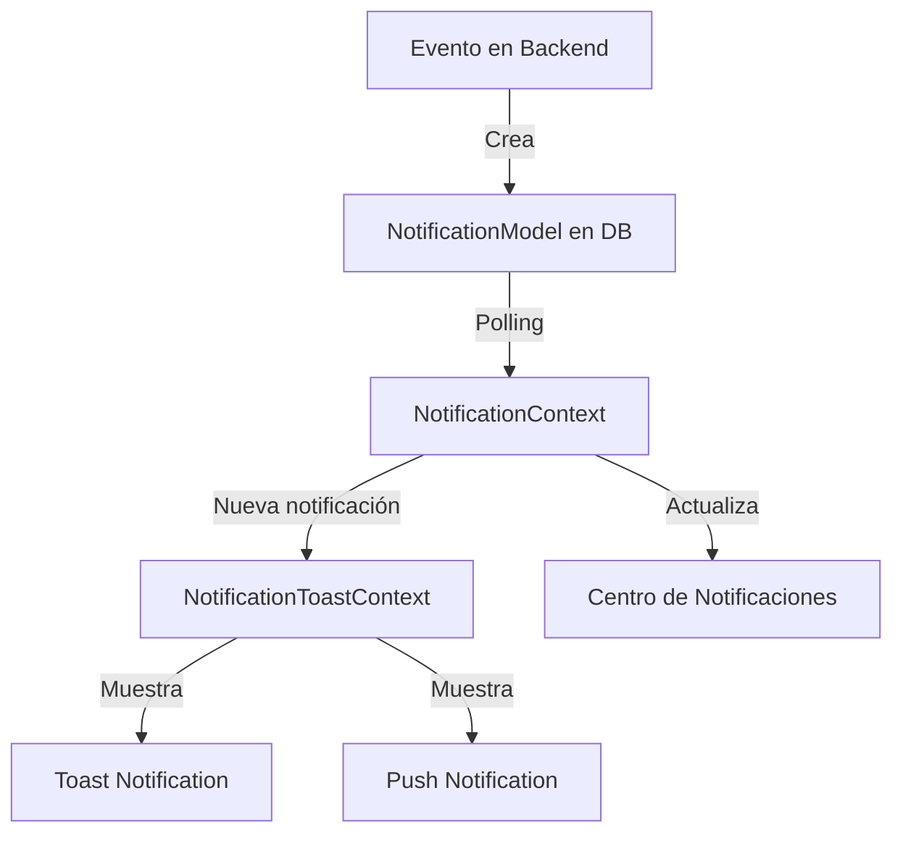

# Sistema de Notificaciones - PetConnect 🔔

## Descripción
Sistema completo de notificaciones que maneja tanto notificaciones persistentes (almacenadas en base de datos) como notificaciones temporales (toast y push notifications).

## Arquitectura

### Backend
Las notificaciones se crean y almacenan en la base de datos usando `NotificationModel`.

#### Estructura de una Notificación
```javascript
{
    userId: ObjectId,      // Usuario destinatario
    title: String,         // Título de la notificación
    message: String,       // Contenido detallado
    type: String,         // Tipo de notificación
    actionUrl: String,    // URL para redirección
    data: Object,         // Datos adicionales
    isRead: Boolean,      // Estado de lectura
    createdAt: Date       // Fecha de creación
}
```

### Frontend
El sistema utiliza dos contextos principales:

1. **NotificationContext**
   - Maneja el estado global de notificaciones
   - Gestiona la comunicación con el backend
   - Realiza polling cada 30 segundos

2. **NotificationToastContext**
   - Maneja notificaciones visuales temporales
   - Integra react-toastify para toast notifications
   - Gestiona notificaciones push del sistema

## Uso

### 1. Crear Notificación desde Backend
```javascript
const NotificationModel = require('../models/NotificationModel');

await NotificationModel.create({
    userId: userId,
    title: 'Título de la notificación',
    message: 'Mensaje detallado',
    type: 'system',
    actionUrl: '/ruta-destino',
    data: {
        // Datos adicionales
    }
});
```

### 2. Crear Notificación desde Frontend
```javascript
import { useNotifications } from '../../Contexts/NotificationContext/NotificationContext';

function Component() {
    const { createNotification } = useNotifications();

    const handleAction = async () => {
        await createNotification({
            type: 'success',
            title: 'Título',
            message: 'Mensaje',
            priority: 'normal',
            actionUrl: '/ruta',
            data: {}
        });
    };
}
```

## Tipos de Notificaciones

### Tipos Disponibles
- `system`: Notificaciones del sistema
- `pet_scan`: Escaneos de QR de mascotas
- `reminder`: Recordatorios veterinarios
- `message`: Mensajes y chat
- `payment`: Pagos y transacciones
- `security`: Alertas de seguridad

### Prioridades
- `high`: Alta prioridad - notificación inmediata
- `normal`: Prioridad normal
- `low`: Baja prioridad

## Ejemplos de Uso

### Notificación de Mascota Encontrada
```javascript
await NotificationModel.create({
    userId: petOwner._id,
    title: '¡Tu mascota ha sido encontrada!',
    message: `${pet.name} ha sido escaneado en ${location}`,
    type: 'pet_scan',
    priority: 'high',
    actionUrl: '/check-protection',
    data: {
        petId: pet._id,
        scanLocation: location
    }
});
```

### Recordatorio Veterinario
```javascript
await NotificationModel.create({
    userId: petOwner._id,
    title: 'Recordatorio de vacuna',
    message: `${pet.name} tiene una vacuna programada para mañana`,
    type: 'reminder',
    priority: 'normal',
    actionUrl: '/health-management',
    data: {
        petId: pet._id,
        reminderType: 'vaccine'
    }
});
```

## Características

- ✅ Notificaciones persistentes en base de datos
- ✅ Toast notifications temporales
- ✅ Push notifications del sistema
- ✅ Agrupación por fecha (hoy, ayer, anteriores)
- ✅ Iconos y colores según tipo
- ✅ Enlaces directos a secciones relevantes
- ✅ Marcado automático como leído
- ✅ Eliminación individual
- ✅ Marcar todas como leídas
- ✅ Contador de no leídas
- ✅ Polling automático

## Componentes UI

- `FooterNav`: Muestra contador de no leídas
- `Notifications`: Centro de notificaciones
- `NotificationRequest`: Solicitud de permisos push

## Flujo de Notificaciones



## Consideraciones

- Las notificaciones push requieren permiso del usuario
- El polling se realiza cada 30 segundos
- Las notificaciones no leídas se destacan visualmente
- Cada tipo de notificación tiene su propio icono y color
- Las notificaciones pueden incluir datos adicionales personalizados